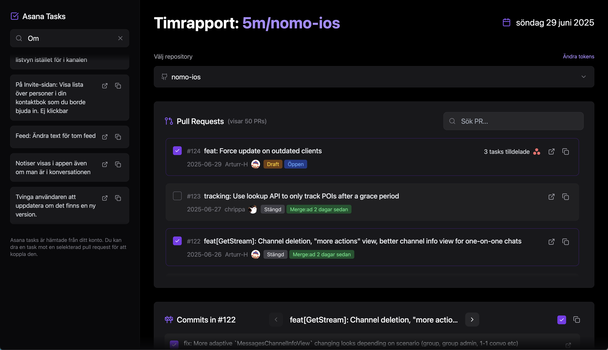
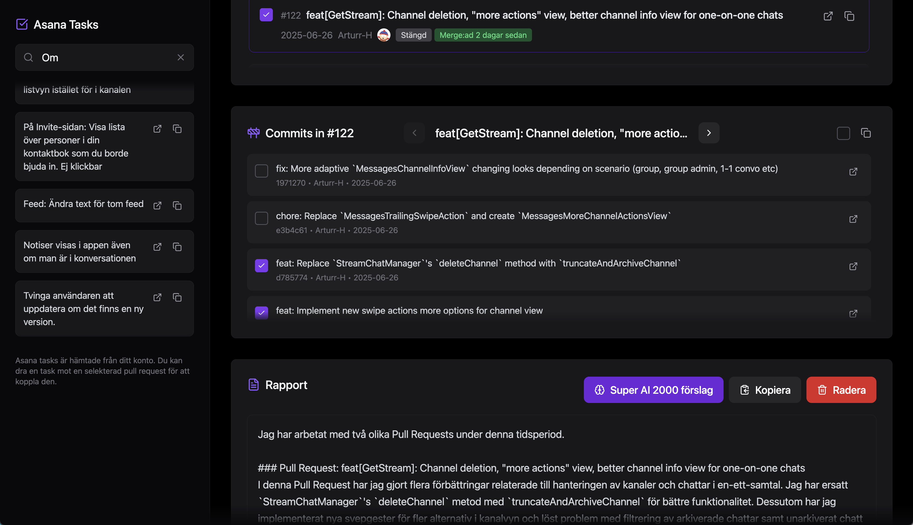

# Timrapporteraren 2000

| Screen 1 | Screen 2 |
| ---- | ---- |
|  |  |

Web-interface för att skapa en timrapport m.h.a asana, github och chatgpt integrationer.

## Installation

1. **Klona projektet**

2. **Skapa API Tokens:**

**Skapa en `.env` fil i root och lägg i följande:**
```bash
GITHUB_TOKEN=din github token här
OPENAI_API_KEY=din openai key här (OPTIONAL, om du vill ha AI-genererade rapporter)
```

**GitHub Personal Access Token:**
   - Gå till GitHub → Settings → Developer settings → Personal access tokens
   - Skapa token med `repo` scope
   - Lägg i `.env`
   - Den ska du också lägga i frontend appen senare
   - Spara i 1password eller nåt
   
**Asana Personal Access Token:**
   - Gå till Asana → My Settings → Apps → Manage Developer Apps
   - Klicka på "Create New Personal Access Token"
   - Ge den ett namn och kopiera token
   - Den lägger du in i frontend appen sen
   - Spara i 1password eller nåt
  
**OpenAI key (DU FÅR HOPPA ÖVER OM DU VILL):**
    - Gå till OpenAI → API keys
    - Klicka på "Create new secret key"
    - Kopiera nyckeln och lägg i `.env`
    - Spara i 1password eller nåt

1. **Starta applikationen:**
```bash
docker-compose up --build
```

1. **Öppna i webbläsaren:**
   - Frontend: http://localhost:8085
   - Backend API: http://localhost:8086/docs

## Användning
Först måste du mata in dina API tokens i websidan. Sedan kan du lägga till / välja ett repository och se dess pull requests. 
Du kan sedan välja en pull request och se dess commits. Varje commit är vald som default, alltså att den kommer att inkluderas i rapporten. Du kan avmarkera commits du inte vill ha med i rapporten.

Du kan dra asana tasks från den vänstra tab-baren till en PR (som du har valt med checkboxen) för att länka, eller "assign:a" dem till PR:en (alltså att PR:en löste den asana tasken).

Sedan kan du klicka på "Super AI 2000 förslag" knappen för att få en AI-genererad rapport baserat på de valda commitsen och asana tasksen. Om du inte har tokens kvar eller en OpenAI key så kommer den att ge en ganska ful men ändå användbar sammanställning som du kan ha som grund för din rapport.
